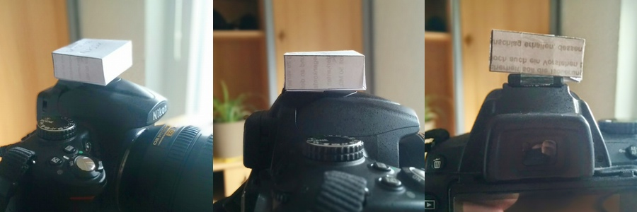
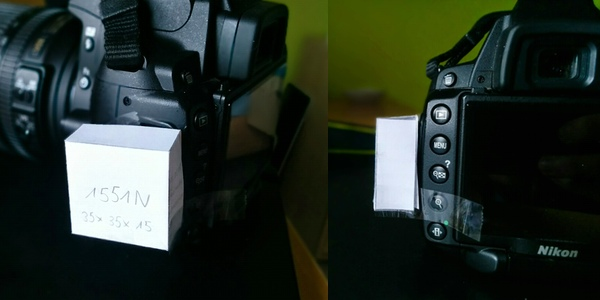

Parts
=====

All parts listed here are subject to change.

|  Item description |       Part No.      |  Size | Qty | Est. Price (Total, €) |
| ----------------- | ------------------- | ----- | --- | --------------------: |
| GPS Module        | Maestro A2235-H     |       |   1 |             13.73 [1] |
| Voltage Regulator | LP29985-33          | SOT23 |   1 |                  0.57 |
| Level Shifter     | MAX3370             | 5SC70 |   1 |                  2.65 |
| Resistor          | 10 kOhm             | 1206  |   1 |                  0.10 |
| Resistor          | 2.2 kOhm            | 1206  |   2 |                  0.20 |
| Capacitor         | 10 nF               | 0805  |   1 |                  0.13 |
| Capacitor         | 1 µF                | 0805  |   1 |                  0.20 |
| Capacitor         | 2.2 µF              | 0805  |   1 |                  0.44 |
| Housing           | Hammond 1551NBK     |       |   1 |                  2.26 |
| PCB               |                     |       |   1 |                 ~5.00 |
| Cable             | From Remote Trigger |       |   1 |             ~5.00 [2] |
| **Grand Total**   |                     |       |     |            **~30.28** |

1: Mouser offers the module to the cheapest price I could find. However, they
have extremely high shipping fees to Germany. Probably makes only sense when
ordering in bulk. Farnell offers the module for ~19€. If you are from Germany as
well, the nice folks at
[mikrocontroller.net](http://www.mikrocontroller.net/topic/320223#new) are
regularly doing Mouser bulk orders in which you can take part.

2: The _really_ cheap triggers are sometimes missing the second row of pins in
the connector (verify with product images). So maybe take one of the slightly
more expensive ones to be sure.

1 x 10kOhm resistors is needed as pull-up for GPIO6 of GPS module (to enable
UART mode). A switch is not required according to the latest user manual of the
GPS module, since it supports a self-starting mode by wiring ON_OFF to the
WAKEUP pin. To shift the voltage level from 3.3V GPS TX to 5V GPS DATA input of
the camera, we will use the MAX3370 IC. A simple transistor circuit has the
disadvantage of inverting the signal which would require additional components
to invert a second time. Another possibility would be to use a 74HCT08 IC in
order to shift the level, but in our case we can't do this due to size
constraints (SOIC14 or TSSOP14 won't fit next to the GPS module in the cases
discussed below). For Baudrate 4800, the GPS module needs two pull-ups (2k2) on
GPIO0 and GPIO1.

The PCB price is a very rough approximation if we manufacture just a single
prototype. If you have the equipment to make PCBs on your own, or if one would
order a large batch, the effective cost per PCB would be much lower. The housing
cost is based on off-the-shelf components glued together (see below, option B).
A 3D-printed case might be cheaper in terms of pure material cost.

## Housing

### Option A: fully self-designed case, 3D printed

If we case completely on our own, we have the benefit of being able to make it
as small as physically possible to fit all the components. Using the dimensions
of the A2235-H and adding some space for the cable and additional components,
the case could have approx 20mm x 28mm x 7mm inner dimensions, plus width of
plastic about 24mm x 32mm x 11mm:

I do not know anything about 3D printing yet, thus it would have to be evaluated
if such dimensions are viable for printining (in terms of thickness etc.) at
all. The cost of material should be pretty cheap for such a small case.

The exact hot shoe dimensions are only available through ISO 518:2006, but it
should be sufficient to precislety measure a regular hot shoe protection cap.
Furthermore, [thingiverse](http://www.thingiverse.com/thing:7992) does have
models for protection caps that could be used as a base.

### Option B: Commercially available housing + mount glued together

We could also use a regular hot shoe cap (e.g. Nikon BS-1 or third party
variants, ~1€) and mount a simple plastic case (e.g. Hammond 1551NBK, ~2.50€) on
top of it. Advantage: easy to acquire, no special hardware needed. Disadvantage:
might look not as clean and possibly larger than needed.

The case Hammond [1551NBK](http://www.farnell.com/datasheets/2872.pdf) looks
pretty good: 35mm x 35mm x 15mm with max. inner dimensions of 28.7mm x 28.7mm x
11mm. Also, it's very cheap, so we might want to consider it at least for the
first prototype. Here's a paper model with dimensions of the 1551NBK on top of a
Nikon D5000:

Alternatively, the cable could be removed completely and instead the plug
soldered directly onto the board. This might allow the module to be mounted to
the camera's side if all the dimensions work out (tbd):

Subtracting the boss height and PCB thickness, we have 6.4mm height left for
compontents. This is **not enough** to fit the GPS module with a max. height of
7.11mm. We can instead use the Hammond 1551**M**BK with a total height of 20mm
(11.4mm for components), or shave off some height from the bosses and use
shorter screws (or glue) to fix the PCB inside the case. Since the height
difference is only 0.7mm, the latter might be the preferrable option.

## Optional: indicator LED on 1PPS pin

We might want to include a led to indicate some sort of status. However, this
will require slightly more energry, thus faster drain of the camera batter (but
probably negligible) and more space on the PCB. With the Hammond case mentioned
above, there should be enough room for that, though. The additional parts are as
follows and the transistor could be connected to the GPS module's 1PPS pin
(resulting in 1 brief flash per second if GPS signal is present):

| Item description |    Part No.    |  Size | Qty | Est. Price (Total, €) |
| ---------------- | -------------- | ----- | --- | --------------------- |
| LED              | Various, green | G1206 |   1 |                  0.16 |
| Resistor         | 40 Ohm         | 1206  |   1 |                  0.10 |
| Resistor         | 100k           | 1206  |   1 |                  0.10 |
| Transistor       | tbd            | SOT23 |   1 |                  0.05 |
