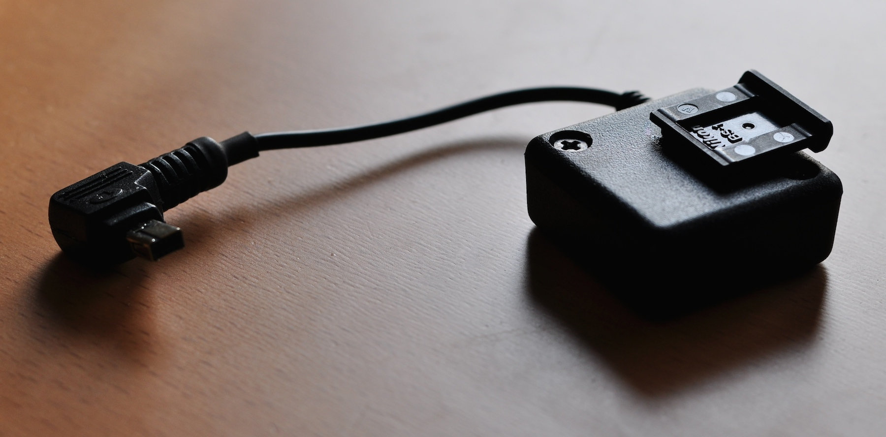
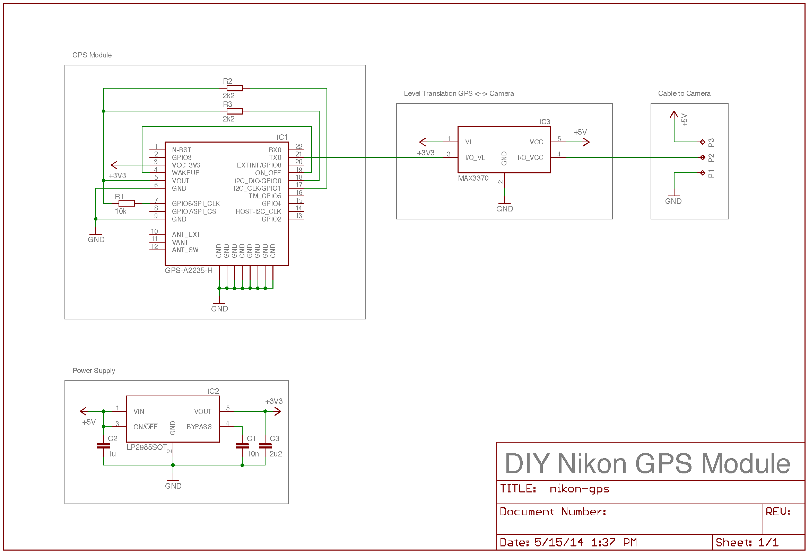
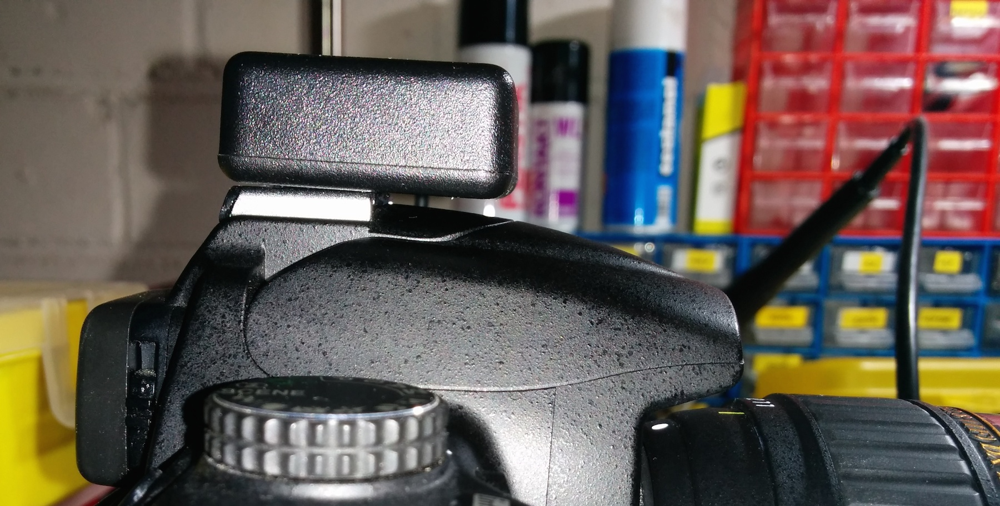
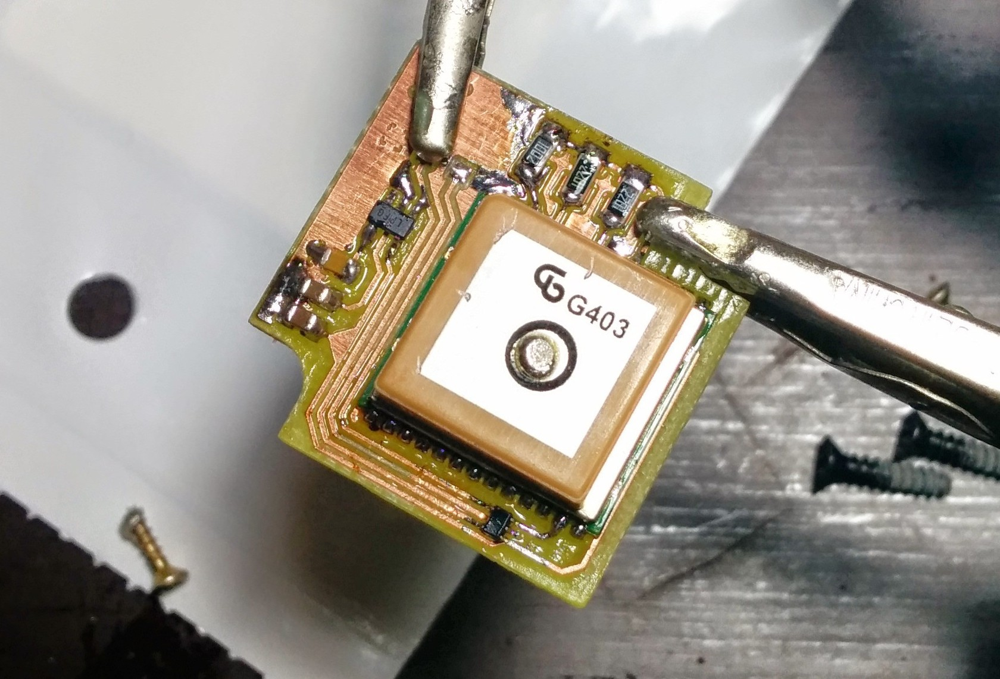

DIY GPS Module for Nikon DSLRs
==============================

Using a GPS Module, most modern Nikon DSLRs are able to automatically geotag
pictures right when taking them. Unfortunately, the official Nikon GP-1 is very
expensive (~200€). This project contains all necessary information to create a
low-cost module which works just as well. This DIY version costs around 30€
(40$).

- [Requirements](#requirements)
  - [Tools](#tools)
  - [Parts](#parts)
  - [Electronic Components](#electronic-components)
- [Building Instructions](#building-instructions)
- [Technical Details](#technical-details)
  - [Nikon GPS Port Specs](#nikon-gps-port-specs)
  - [Protocol](#protocol)
  - [Schematics](#schematics)
- [Images](#images)
- [Sources](#sources)

See also the [Building Log](BUILD.md).

Requirements
------------

### Tools

- Soldering Equipment
- Sharp knife to cut soft plastic
- A small dremel or similar to cut hard plastic
- Plastic Glue
- Screwdriver

### Parts

| Item              | Description                                              |
| ----------------- | -------------------------------------------------------- |
| Case              | Hammond 1551NBK                                          |
| PCB               | Board layout available in [eagle](eagle/) folder. Either create your own if you have the equipment, visit your local [FabLab](http://en.wikipedia.org/wiki/Fablab) or let the PCB be created professionally (look for cheap companies in your region). |
| Cable & Connector | Can be taken from a cheap remote cable trigger.          |

### Electronic Components

|  ID |  Item description |     Part No.    |  Size |
| --- | ----------------- | --------------- | ----- |
| IC1 | GPS Module        | Maestro A2235-H |       |
| IC2 | Voltage Regulator | LP29985-33      | SOT23 |
| IC3 | Level Shifter     | MAX3370         | 5SC70 |
| R1  | Resistor          | 10 kOhm         | 1206  |
| R2  | Resistor          | 2.2 kOhm        | 1206  |
| R3  | Resistor          | 2.2 kOhm        | 1206  |
| C1  | Capacitor         | 10 nF           | 0805  |
| C2  | Capacitor         | 1 µF            | 0805  |
| C3  | Capacitor         | 2.2 µF          | 0805  |

Building Instructions
---------------------

1. Disassemble the remote trigger. If the cable has only 3 wires, you will have
   to cut the connector in half and rewire them to pins 3, 4 and 7. Use plastic
   glue and a vice to put the two connector halves back together after rewiring.
   Before rewiring, you can optionally shorten the cable to your desired length.
   Make sure to preserve the cable protection on the side of the trigger. We
   will reuse it for our GPS module.
2. Solder all electronic components onto the the PCB. I have done this in the
   order from largest to smallest, but do whatever is most comfortable to you.
   You might also want to consider reflow soldering, especially for the GPS
   module. If you do regular soldering, feel free to keep the ground pads on the
   bottom of the GPS module unconnected. I have done so and it does not cause
   any issues.
3. (optional, recommended) Do an electrical check of the PCB using a Multimeter.
   Make sure no pads are connected that shouldn't be connected.
4. (optional) Attach a 5V power source to the board (pads P1 and P3). Attach an
   oscilloscope to P2. You should see a burst of data coming in at about 1Hz,
   otherwise the pin should have a high level (+5V).
5. The PCB will be placed inside the lid of the case. Optional: use glue to
   attach the PCB permanently.
6. Use a dremel to cut a slot into the case with the width of the cable. Check
   if the original cable protection fits into the slot and adjust if necessary.
7. Shorten the part of the cable which will be inside the case and solder the
   wires to pads P1-P3.
8. Assemble the case by using the supplied case screws.
9. Go outside and check if the device operates properly. **Note:** it might take
   a while for the first GPS fix. Make sure to have a good visibility to the
   sky.
10. (optional) Use plastic glue to attach a hot shoe protection cap to the lid
    of the case (such that the GPS antenna will face upward). This will allow
    for a secure mounting of the device on the camera.

Technical Details
-----------------

### Nikon GPS Port Specs

* Proprietary 8-pin connector,
  [pinout](http://pinoutsguide.com/DigitalCameras/nikon_d90_pinout.shtml)
* Operating voltage: 5V

### Protocol

The camera awaits NMEA-compliant messages over the GPS DATA pin. Data is
transmitted via UART with 4800 baud, no parity, 1 stop bit.

### Schematics

The schematics and PCB layout was created using Eagle. You can find all required
files in the [eagle](eagle/) subdirectory. Additionally, the folder
[eagle-lbr](eagle-lbr/) contains a library of custom made components which are
not part of the original Eagle libraries. Since the camera accepts raw NMEA
data, the circuit is extremely simple and does not require additional
controllers. The only difficulty is based in the operating voltage: the camera
uses 5V while the GPS module operates with 3.3V. Therefore a voltage regulator
and level shifter has been added to ensure correct levels on both sides.

Images
------

Sources
-------

1. [Peter Miller Photography](http://www.petermillerphoto.com/nikongps/nikongps2.html)
2. [Homepage of Bálint Kis](http://www.k-i-s.org/index.php?item=13)
3. [Pinouts Guide](http://pinoutsguide.com/DigitalCameras/nikon_d90_pinout.shtml)
