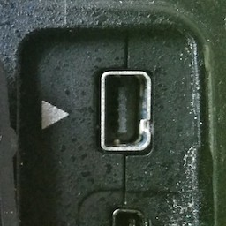

DIY GPS Module for Nikon DSLRs
==============================

Using a GPS Module, most modern Nikon DSLRs are able to automatically geotag
pictures right when taking them. Unfortunately, the official Nikon GP-1 is very
expensive (~200€). In this project I'll try to build an equivalent module using
low-cost components. If everything works out as planned, no microcontroller is
required. Instead, we can attach the GPS module directly to the camera.

**Project Status:**

See also the [Building Log](BUILD.md).

```
[x] planning, searching for parts
[x] schematics design
[x] PCB design
[i] functional prototype
[-] housing design: using an off-the-shelf case for now

i = in progress, x = done
```


Nikon GPS Port Specs
--------------------



* Proprietary 8-pin connector,
  [pinout](http://pinoutsguide.com/DigitalCameras/nikon_d90_pinout.shtml)
* Operating voltage: 5V
* GPS pin expects NMEA data via UART
* UART specs: 4800 baud, no parity, 1 stop bit


Required Parts
--------------

* A cable which fits to the prop. connector. Cheapest source: third party cable
  remote triggers (< 10€) which can be cut off at an appropriate length.
* A GPS module, see GPS for more details.
* Housing for the parts, ideally fitting on camera's the hot shoe mount.
* Supporting electronics for voltage regulation etc.

**Note regarding the remote trigger:** usually they have only 3 pins wired (GND,
Focus & Shutter). That means you have to take the connector apart, resolder the
wires to GND, +5V and GPS Data and then glue the connector back together. In my case, I have done the following:

1. Cut the plastic connector with an x-acto knife along the visible seam (from
   injection molding ?)
2. Rewiring is straightforward, you can reuse the orignal cable because 3 wires
   are sufficient for our purpose.
3. When putting the two halves back together I noticed a small gap. Therefore
   I've used a dremel tool to make a bit more room for the cable in the interior
   of the connector.
4. Apply plastic glue to the connector's inside surface and use a vise to press
   the parts together.
5. After the glue has dried, there's almost no visible indication of the
   disassembly, I hope the cable will be just as durable as the unmodified one.

A rough list of required parts and first sketches of the casing can be found in
[PARTLIST.md](PARTLIST.md).


### GPS

I'm still searching for the perfect module. The best one I have found so far
is the Maestro A2235H ([farnell](http://goo.gl/wVIlpc)). At a price of 19€
it's reasonably cheap while featuring an internal antenna as well as perfectly
matching default transmission settings (4800baud UART). That means no
configuration is necessary and we can assemble the unit right away.

One downside of the A2235H is that it needs an explicit low-high signal to
power up the module after power has been supplied. We can either do this
manually (using a push-button) or possibly also automatically ~1s after
plugging the device in.

Update: there is no need for a switch, according to a more recent revision of
the documentation the module supports self-starting by connecting the WAKEUP to
the ON/OFF pin. All in all, this is the module I have settled one because it's
also the most competitive one with regards to pricing.


### Housing

Finding a good housing is always quite difficult if the end product should
look good. It will mostly depend on the PCB which is yet to be determined. 3D
printing might be a good option in order to get a fitting mount for DSLR hot
shoes. For those who don't own a 3D printer (including me), this can be done
e.g. in your local [FabLab](http://en.wikipedia.org/wiki/Fablab) either very
cheaply or usually even for free.

Update: as you can see in [PARTLIST.md](PARTLIST.md) I will be using an
off-the-shelf case for now. By coincidence, the Hammond 1551N case has pretty
much the perfect size.


### Supporting Electronics

If we use the A2235H, we will have to use a voltage regulator since the module's
operating voltage is at 3.3V. From previous projects, the LP2985-33 low dropout
regulator is cheap, small and easy to use. It can drive up to 150mA which is
more than enough for the GPS module. For the on-off mechanics of the A2235H we
need either a push-button or a simple timer-based circuit that sends an impulse
to the module about a second after the circuit has been powered on.

Additionally, the outgoing data has to be converted from 3.3V module voltage
back to the 5V operating voltage of the camera, since the GPS DATA input port
apparently does not work reliably with 3.3V levels. A simple transistor circuit
might be sufficient here, this will be evaluated in future experiments.

Apart from that we might want to throw in small capcaitors here and there to
dampen noise on the circuit, but that should be pretty much it.


Sources
-------

1. [Peter Miller Photography](http://www.petermillerphoto.com/nikongps/nikongps2.html)
2. [Homepage of Bálint Kis](http://www.k-i-s.org/index.php?item=13)
3. [Pinouts Guide](http://pinoutsguide.com/DigitalCameras/nikon_d90_pinout.shtml)
